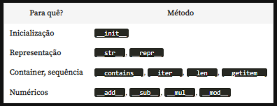
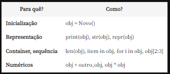

# 2.1 COURSE - Python 3 - Advancing Object Orientation

## heritage (herança)
if we have a class called Programa and we want to inherit it's attributes and methods, we must use the following declaration:
```
class child_class(mother_class)
    ...
```
With this heritage, we inherit all the methods from the mother class, but we still need to repeat the attributes, to avoid that problem we can use the function ```super()``` that creates an object from the mother's class, so we don't need declare the attributes again.
```
class child_class(mother_class)
    super().__init__(mother_attr1, mother_attr2, ..., child_attribute1, child_atribute2, ...)
    self.__child_attribute1 = child_attribute1
```
A problem that comes from this concept are the private attributes. The childs now don't have access to the mother's attributes, and to fix this problems, now we must declare private attributes with only one ```_```, ex: ```_nome```.
```
class Programa:
    def __init__(self, nome, ano):
        self._nome = nome.title()
        self._ano = ano
        self._likes = 0

        @property
        def likes(self):
            return self._likes

        def dar_likes(self):
            self._likes += 1

        @property
        def nome(self):
            return self._nome

        @nome.setter
        def nome(self, novo_nome):
            self._nome = novo_nome.title()

class Filme(Programa):
    def __init__(self, nome, ano, duracao):
        super().__init__(nome,ano)
        self.duracao = duracao

class Serie(Programa):
    def __init__(self, nome, ano, temporadas):
        super().__init__(nome,ano)
        self.temporada = temporadas
```

## class methods (métodos de classe)
These are methods declared with @classmethod. When we create a class method, we have access to the class's attributes. Similarly with class attributes, we can access these methods from within instance methods, from ```__class__```.
```
class Funcionario:
    prefixo = 'Instrutor'

    @classmethod
    def info(cls):
        return f'Esse é um {cls.prefixo}'
```

## Object string representation with __str__(self)
in python we can print any object as a str with this method
```
class Serie(Programa):
    def __init__(self, nome, ano, temporadas):
        super().__init__(nome,ano)
        self.temporada = temporadas

    def __str__(self):
    return f'{self._nome} - {self._ano} - {self._temporadas}'

>>> GOT = Serie('game of thrones', 2020, 5)
>>> print(GOT)
game of thrones - 2020 - 5
```

## python data model
these are the special methods:
<br/>

<br/>
And what are they for:
<br/>
